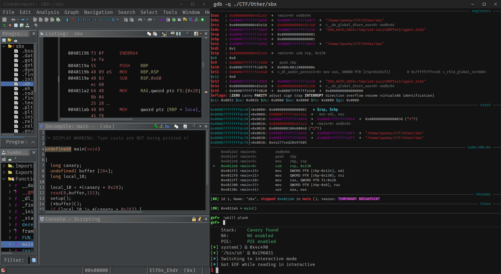

# 🧨 What is Binary Exploitation?

Binary exploitation is the art of taking advantage of flaws in a program to make it do something it wasn’t supposed to — like giving you control over it.

Imagine a program as a vending machine. You press buttons, and it follows a fixed set of instructions to give you a snack. But what if there's a flaw in the design — a hidden sequence that lets you get snacks for free, or even open the whole machine?

That’s binary exploitation: finding and using those hidden flaws to manipulate how software behaves.

---

## 💡 The Importance of Binary Exploitation

Okay great, we can exploit programs and make them do things we want, but why should I care?

Because understanding how software breaks teaches you how it works.

- It’s the foundation of real-world hacks — privilege escalation, malware, jailbreaks, CTFs, you name it.
- It forces you to think like an attacker — and that's exactly how defenders get better.
- It sharpens your low-level skills — memory, assembly, debugging — things most devs avoid, but hackers master.
- It’s how security researchers discover and report zero-days.
- It’s a valuable skillset — whether you’re aiming for CTFs, red teaming, reverse engineering, or exploit dev.

#### 🔧 What This Workshop Is Really About

We’re not just here to memorize techniques.

You’ll learn to **spot vulnerabilities**, but more importantly, you’ll learn to **think and work like an exploiter**:

- Getting hands-on with real tools like [[01-gdb]], [[02-ghidra]], and [[03-pwntools]].
- Understanding what’s happening under the hood.
- Getting comfortable in unfamiliar territory — and learning to figure things out fast.

!!! note
	**Tool fluency matters more than exploit recipes.**  
	That’s what separates a skilled hacker from someone who just copies code.

## 🛠️ Core Tools We'll Use

Tools are the medium of interacting with our binaries. Nobody today (unless absolutely hardcore and insane) works directly with the 1s and 0s of computers.

- **[[01-gdb]]** – for live debugging and memory inspection.
- **[[02-ghidra]]** – for reverse engineering and static analysis.
- **[[03-pwntools]]** – a Python library for building and testing exploits.

!!! note "Learning these tools is key"
	Techniques change. Tools change. But knowing how to explore and break binaries is what makes you effective.
