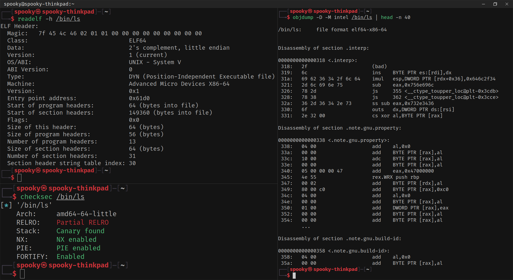

# ⚙️ Basics of Assembly Language (x86/x86-64)

Assembly is the low-level language closest to machine code. Learning some basics helps you understand how binaries work and how to craft exploits.
Important Registers:

- `rax`, `rbx`, `rcx`, `rdx`: General-purpose (often used for math, arguments, returns)
- `rsp`: Stack pointer (points to the top of the stack)
- `rbp`: Base pointer (marks the base of the current stack frame)
- `rip`: Instruction pointer (points to the next instruction to execute)


### Common Instructions:
| Instruction     | Description                                      |
| --------------- | ------------------------------------------------ |
| `mov rax, 0x1`  | Move the value `0x1` into register `rax`         |
| `add rax, rbx`  | Add the value in `rbx` to `rax`                  |
| `cmp rax, rbx`  | Compare `rax` and `rbx`                          |
| `jmp 0x400123`  | Jump to the instruction at address `0x400123`    |
| `call function` | Call a function (pushes return address on stack) |
| `ret`           | Return from function (pops return address)       |

### Example:

```asm
mov rax, 0x1
add rax, 0x2
ret
```
	^ This moves 1 into `rax`, adds 2, and returns — `rax` now holds 3.

### 🔧 Tools for Assembly Analysis:

- `objdump -d -M intel [file]` — Disassemble executable code (Intel syntax)
- `gdb [file]` — Debug binary interactively at runtime

### 💡 Final Tips:

Assembly isn't learned overnight, it takes time and practice — don’t get discouraged! Always keep references handy and look up instructions as you go.