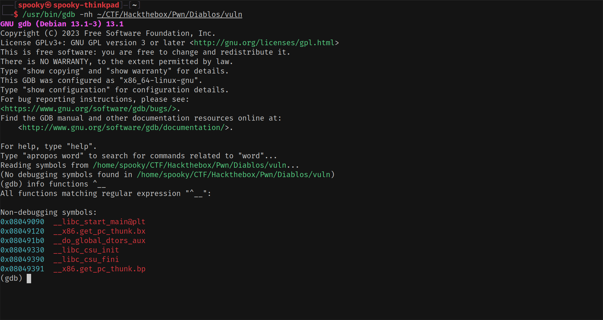
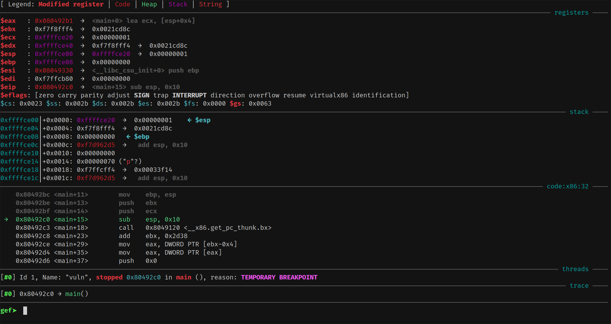

^ (default GDB – no extra tools, no context window, very basic)

# 🛠️ What is GDB?

GDB is the standard GNU debugger used by Linux developers to debug compiled applications — but for exploit developers, it’s an essential tool to reverse and break things!

---

## 🧪 Try It Yourself

```bash
$ gdb -q /bin/ls
(gdb) start
```

This opens `/bin/ls` in GDB and begins execution right before `main()`.

---

## 🕹️ What’s a Debugger, Really?

A **debugger** is like a **time machine** for programs:
You can pause, inspect, step through, or even change execution on the fly.

For exploit developers, it’s invaluable for:

- Analyzing control flow  
- Watching memory in real time  
- Testing and refining payloads  

---

## 💣 Why GDB Matters for Exploit Devs

While developers use GDB to fix bugs, **exploit devs use it to *find* them.**

You’ll:

- Inspect registers and stack at crash points
- Set breakpoints to trap execution at the right time
- Craft and debug shellcode or ROP chains step by step

---

# 💉 GEF – GDB Enhanced Features


^ (GEF loaded – colorful, structured UI, context-aware)

While vanilla GDB works, it’s… minimal.

That’s where **[GEF (GDB Enhanced Features)](https://github.com/hugsy/gef)** comes in. It provides:
- A better UI with a clear context window
- Syntax highlighting and register coloring
- Built-in commands for heap analysis, format string exploits, syscall tracing, and more

---

## 🚀 Installing GEF

Installation is super simple:

```bash
bash -c "$(curl -fsSL https://gef.blah.cat/sh)"
```

This script safely adds the plugin to your `~/.gdbinit` so GEF loads automatically whenever you start GDB.

---

# 🧠 GDB + GEF Cheatsheet

| 🧭 Category             | 🛠️ Command                          | 🧾 Description                                  |
|------------------------|-------------------------------------|------------------------------------------------|
| ▶️ Run/Control          | `run`                               | Start the program                              |
|                        | `start`                             | Run and stop at `main`                         |
|                        | `continue` / `c`                    | Resume execution                               |
|                        | `next` / `n`                        | Step **over** function calls                   |
|                        | `step` / `s`                        | Step **into** function calls                   |
|                        | `finish`                            | Run until current function returns             |
|                        | `jump *0xADDR`                      | Set instruction pointer (skip code)            |
| 🧨 Breakpoints         | `break main`                        | Break at function                              |
|                        | `break *0xADDR`                     | Break at exact address                         |
|                        | `info breakpoints`                  | List breakpoints                               |
|                        | `delete N`                          | Delete breakpoint number N                     |
|                        | `disable N` / `enable N`            | Toggle breakpoint                              |
| 🧠 Registers           | `info registers`                    | View all registers                             |
|                        | `set $rax = 0x1234`                 | Modify register                                |
| 🧬 Memory Inspection   | `x/32x $rsp`                        | View memory in hex                             |
|                        | `x/s $rdi`                          | View string at address                         |
|                        | `x/16i $rip`                        | Disassemble next 16 instructions               |
|                        | `x/gx 0xADDR`                       | View 64-bit word at address                    |
|                        | `x/32b 0xADDR`                      | Dump 32 bytes at address                       |
| 🧱 Disassembly         | `disassemble main`                  | Disassemble function                           |
|                        | `telescope $rsp`                    | Show memory stack layout (GEF)                 |
|                        | `context`                           | Show GEF context (registers, stack, etc)       |
| 🧩 Stack & Heap (GEF)  | `telescope $rbp`                    | View memory from frame pointer                 |
|                        | `heap chunks`                       | Display heap metadata                          |
|                        | `dereference 0xADDR`                | Show what's pointed to                         |
| 🧪 Exploit Helpers     | `pattern create 100`                | Generate cyclic pattern                        |
|                        | `pattern offset 0x41414141`         | Find offset in pattern                         |
| 💀 Debug Info          | `backtrace` / `bt`                  | Show function call stack                       |
|                        | `info frame`                        | Show current stack frame                       |
|                        | `info functions`                    | List functions in binary                       |
|                        | `info files`                        | Show loaded binary and its sections            |
| 📂 Arguments/Files     | `set args ARG1 ARG2`                | Set command-line arguments                     |
|                        | `file ./a.out`                      | Load a binary                                  |
|                        | `symbol-file ./a.out`               | Load debug symbols                             |
|                        | `checksec`                          | List enabled security features                 |


## 🧭 Final Tip

💡 **Always use GDB with GEF for binary exploitation**. It speeds up learning and makes debugging binaries 10x more intuitive.

If you're feeling fancy later, you can also explore:
- [Pwndbg](https://github.com/pwndbg/pwndbg) – another GDB plugin with exploit dev features

---

!!! tip
	🧠 Mastering GDB is one of the best investments you can make as an exploit developer.
