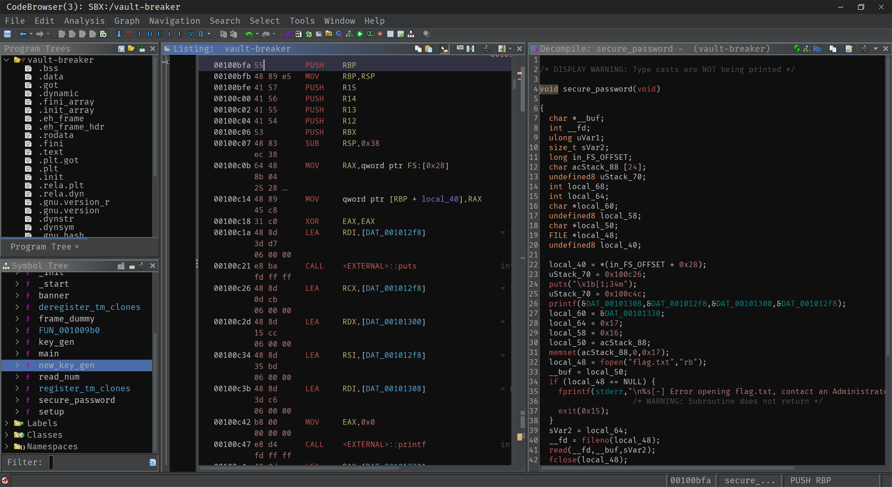

# 🧠 What is Ghidra?

**Ghidra** is a powerful open-source reverse engineering tool developed by the NSA. It helps you analyze compiled programs by converting machine code into a human-readable format.

Perfect for reverse engineers, vulnerability researchers, and binary exploit devs.

---

## 📦 Installation

🔗 [Download the latest release](https://github.com/NationalSecurityAgency/ghidra/releases)

**Note:** Java OpenJDK **must** be installed (JDK 17+ recommended).

---

## 🚀 Try It Yourself

Launch Ghidra with:

```bash
./ghidraRun
```

Then:

1. Create a **new project**.
2. Import a binary like `/bin/ls`.
3. Double-click the binary to open it in **CodeBrowser**.

🎉 You've just disassembled your first binary!

---

## 🧰 What’s a Disassembler vs Decompiler?

- **🔍 Disassembler**  
  > Translates machine code into **assembly code**, instruction by instruction.

- **🧬 Decompiler**  
  > *Attempts* to recreate the original source code from machine code.

⚠️ Decompilers aren't perfect — especially if the binary uses **anti-reversing techniques**.

---

## 🕵️‍♂️ Why Is This Useful for Exploit Devs?

When you don't have the source code:

- You can **find important functions**
- Analyze **control flow and logic**
- Spot **potential vulnerabilities**  
- Understand **how user input is handled**

---

> 🧩 Reverse engineering is half the battle in binary exploitation — and Ghidra makes it accessible and visual.

🔗 Later on, try pairing Ghidra with tools like:
- `gdb` for dynamic analysis
- `pwntools` for scripting exploits

---

!!! tip "Pro Tip 💡"
	Learn the Ghidra hotkeys — they’ll save you tons of time.