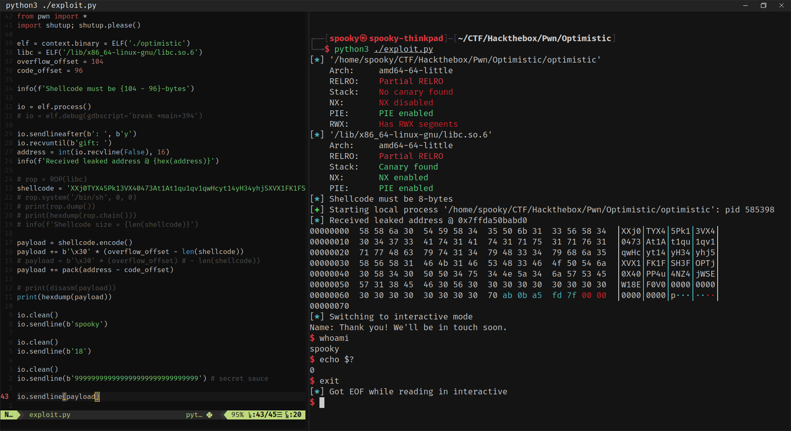

# 🐍 What is Pwntools?

**Pwntools** is a Python library built for exploit development. It makes it easy to:

- Automate interaction with binaries and processes
- Craft payloads and shellcode
- Bypass protections with elegant, scriptable logic

Whether you're CTF-ing or writing real-world exploits, Pwntools is your best friend.

---

## 🧰 Installation

Make sure your system is ready, then install Pwntools:

```bash
$ sudo apt-get update
$ sudo apt-get install python3 python3-pip python3-dev git libssl-dev libffi-dev build-essential
$ python3 -m pip install --upgrade pip
$ python3 -m pip install --upgrade pwntools
```

---

## 🚀 Try It Yourself

Launch a binary using Pwntools in just a few lines:

```python
from pwn import *

p = process("/bin/ls")
p.interactive()
```

You've just spun up a binary and gained interactive control over it — all in Python!

---

## 🤖 Why Use Pwntools?

Instead of manually interacting with GDB or a terminal, Pwntools lets you:

- Send/receive input and output from programs
- Automate full exploitation workflows
- Format payloads and generate shellcode
- Work locally or connect to remote services

---

## 💥 Pwntools for Exploit Development

Pwntools makes your exploit scripts:

- **Repeatable** — easily test and tweak without manual work
- **Readable** — clear logic, clean syntax
- **Flexible** — interact locally or over the network

---

!!! note
	🔁 Exploit dev is trial and error — Pwntools makes iteration painless.

🧠 Bonus: Combine Pwntools with GDB (via `gdb.attach(p)`) to debug live during exploit dev!

---

💡 Explore the [Pwntools docs](https://docs.pwntools.com/en/stable/) to unlock powerful tools like:

- `p32()` / `u64()` for packing/unpacking
- `asm()` and `shellcraft` for shellcode
- `ROP()` for crafting ROP chains